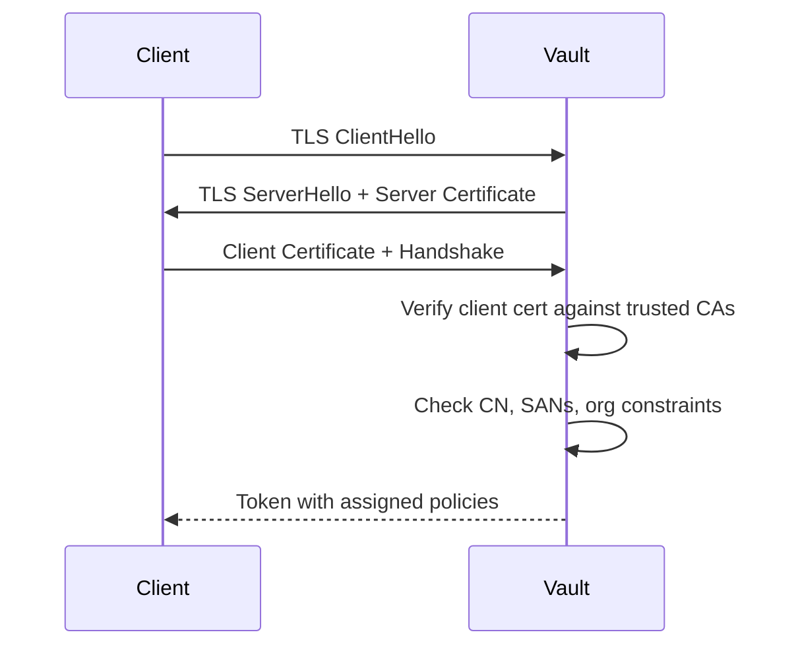

The TLS certificate auth method allows authentication using SSL/TLS client certificates. Vault validates that the presented certificate is signed by a trusted CA and optionally checks Subject Alternative Names (SANs), Common Name, organizational units, and X.509 extensions.

## Enabling cert auth

```bash
vault auth enable cert
```

## Setting up certificate roles

Certificate roles (also called trusted certificates) define which CA-signed certificates are allowed to authenticate and which policies they receive.

### Create a certificate role

```bash
vault write auth/cert/certs/web \
  display_name="web" \
  policies="web-policy" \
  certificate=@/path/to/ca-cert.pem \
  token_ttl="1h"
```

With additional constraints:

```bash
vault write auth/cert/certs/app-server \
  display_name="app-server" \
  policies="app-policy" \
  certificate=@/path/to/ca-cert.pem \
  allowed_common_names="app.example.com,*.app.example.com" \
  allowed_dns_sans="app.example.com" \
  allowed_organizations="Example Corp" \
  token_ttl="2h" \
  token_max_ttl="8h"
```

## Certificate role parameters

<ParamField path="name" type="string" required>
  The name of the certificate role.
</ParamField>

<ParamField path="certificate" type="string" required>
  The public CA certificate that should be trusted, in x509 PEM-encoded format. This CA is used to validate client certificates.
</ParamField>

<ParamField path="display_name" type="string">
  The display name to use for clients using this certificate. Defaults to the certificate role name.
</ParamField>

<ParamField path="allowed_names" type="string[]">
  A list of names. At least one must exist in either the Common Name or SANs. Supports globbing. Deprecated — use `allowed_common_names`, `allowed_dns_sans`, `allowed_email_sans`, or `allowed_uri_sans` instead.
</ParamField>

<ParamField path="allowed_common_names" type="string[]">
  A list of names. At least one must match the certificate's Common Name. Supports globbing.
</ParamField>

<ParamField path="allowed_dns_sans" type="string[]">
  A list of DNS names. At least one must exist in the certificate's DNS SANs. Supports globbing.
</ParamField>

<ParamField path="allowed_email_sans" type="string[]">
  A list of email addresses. At least one must exist in the certificate's email SANs. Supports globbing.
</ParamField>

<ParamField path="allowed_uri_sans" type="string[]">
  A list of URIs. At least one must exist in the certificate's URI SANs. Supports globbing.
</ParamField>

<ParamField path="allowed_organizational_units" type="string[]">
  A list of organizational unit names. At least one must exist in the certificate's OU field.
</ParamField>

<ParamField path="allowed_organizations" type="string[]">
  A list of organization names. At least one must exist in the certificate's O field. Supports globbing.
</ParamField>

<ParamField path="required_extensions" type="string[]">
  A list of extensions formatted as `oid:value`. Expects the extension value to be an ASN1-encoded string. All values must match. Supports globbing on `value`.
</ParamField>

<ParamField path="allowed_metadata_extensions" type="string[]">
  A list of OID extensions. Upon successful authentication, these extensions are added to the token metadata if present in the certificate. Keys use dash-separated OID numbers instead of dots.
</ParamField>

#### OCSP parameters

<ParamField path="ocsp_enabled" type="boolean" default="false">
  Whether to attempt OCSP verification of certificates at login.
</ParamField>

<ParamField path="ocsp_ca_certificates" type="string">
  Any additional CA certificates needed to communicate with OCSP servers.
</ParamField>

<ParamField path="ocsp_servers_override" type="string[]">
  A list of OCSP server addresses. If unset, the OCSP server is determined from the `AuthorityInformationAccess` extension.
</ParamField>

<ParamField path="ocsp_fail_open" type="boolean" default="false">
  If true, login proceeds even if an OCSP revocation check cannot be completed. If false, failing to get an OCSP status fails the login.
</ParamField>

<ParamField path="ocsp_query_all_servers" type="boolean" default="false">
  If true, queries all OCSP servers and considers the certificate valid only if all agree.
</ParamField>

<ParamField path="ocsp_max_retries" type="number" default="4">
  The number of retries the OCSP client should attempt per query.
</ParamField>

#### Token parameters

<ParamField path="token_policies" type="string[]">
  List of Vault policies to assign to the token issued on login.
</ParamField>

<ParamField path="token_ttl" type="string">
  The incremental lifetime for generated tokens.
</ParamField>

<ParamField path="token_max_ttl" type="string">
  The maximum lifetime for generated tokens.
</ParamField>

<ParamField path="token_period" type="string">
  If set, tokens will be periodic with the given period.
</ParamField>

<ParamField path="token_bound_cidrs" type="string[]">
  List of CIDR blocks restricting which IPs can use the returned token.
</ParamField>

## Logging in with a client certificate

```bash
# Login using a client certificate and key
vault login \
  -client-cert=/path/to/client-cert.pem \
  -client-key=/path/to/client-key.pem \
  -method=cert \
  name=web
```

Or using `curl`:

```bash
curl \
  --cert /path/to/client-cert.pem \
  --key /path/to/client-key.pem \
  --request POST \
  https://vault.example.com:8200/v1/auth/cert/login
```

## Mutual TLS authentication flow



## Configuring Vault TLS

For cert auth to work, Vault must be configured to request and verify client certificates:

```hcl
# vault.hcl
listener "tcp" {
  address            = "0.0.0.0:8200"
  tls_cert_file      = "/path/to/server-cert.pem"
  tls_key_file       = "/path/to/server-key.pem"
  tls_client_ca_file = "/path/to/client-ca.pem"
  tls_require_and_verify_client_cert = false  # Vault handles this internally
}
```

<Info>
  Setting `tls_require_and_verify_client_cert = true` at the listener level requires all connections to Vault to present a client certificate, not just cert auth logins. In most configurations, let Vault handle the client certificate verification at the auth method level.
</Info>

## Listing and managing certificate roles

```bash
# List certificate roles
vault list auth/cert/certs

# Read a certificate role
vault read auth/cert/certs/web

# Delete a certificate role
vault delete auth/cert/certs/web
```

## CRL management

Vault can check Certificate Revocation Lists (CRLs) to prevent revoked certificates from authenticating:

```bash
# Add a CRL
vault write auth/cert/crls/revoked-certs \
  crl=@/path/to/revoked.crl

# List CRLs
vault list auth/cert/crls
```

<Warning>
  Non-CA certificates must have `TLS Client Authentication` set as an extended key usage. If a non-CA certificate does not have this, Vault will reject it with an error.
</Warning>
