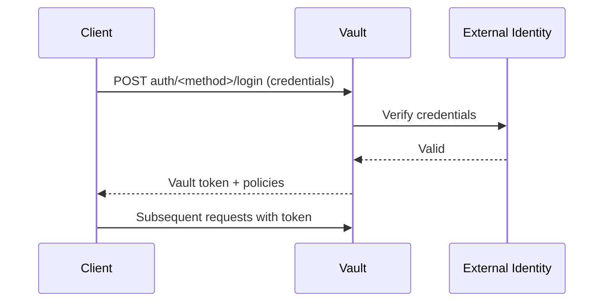

Auth methods are the components in Vault that perform authentication. They are responsible for assigning identity and a set of policies to a user or machine. When authentication succeeds, Vault returns a **client token** used for all subsequent requests.

## How auth methods work

Every auth method maps external identity (GitHub username, AWS IAM role, LDAP group, etc.) to one or more Vault policies. The login flow is:



## Enabling an auth method

Auth methods must be explicitly enabled before use. Most auth methods can be enabled multiple times at different paths.

```bash
# Enable at the default path
vault auth enable <type>

# Enable at a custom path
vault auth enable -path=my-github github

# List enabled auth methods
vault auth list
```

<Note>
  The token auth method is built-in and is always enabled at `auth/token`. It cannot be disabled.
</Note>

## Auth method paths

Auth methods are mounted at `auth/<path>/`. The default path equals the auth method type:

| Method | Default path |
|--------|-------------|
| token | `auth/token/` |
| approle | `auth/approle/` |
| aws | `auth/aws/` |
| github | `auth/github/` |
| ldap | `auth/ldap/` |
| userpass | `auth/userpass/` |
| cert | `auth/cert/` |
| okta | `auth/okta/` |

## Common token configuration

All auth methods that issue tokens support these standard token parameters:

<ParamField path="token_ttl" type="string">
  The incremental lifetime for generated tokens. This current value of this will be referenced at renewal time. If 0 or not set, the system default will be used.
</ParamField>

<ParamField path="token_max_ttl" type="string">
  The maximum lifetime for generated tokens. This current value of this will be referenced at renewal time. If 0 or not set, the system default will be used.
</ParamField>

<ParamField path="token_policies" type="string[]">
  List of policies to encode onto generated tokens. Depending on the auth method, this list may be supplemented by user/group/role values.
</ParamField>

<ParamField path="token_bound_cidrs" type="string[]">
  List of CIDR blocks. If set, specifies blocks of IP addresses which can authenticate successfully, and also sets the resulting token so it can only be used from those CIDR blocks.
</ParamField>

<ParamField path="token_explicit_max_ttl" type="string">
  If set, will encode an explicit max TTL onto the token. This is a hard cap even if `token_ttl` and `token_max_ttl` would otherwise allow a renewal.
</ParamField>

<ParamField path="token_no_default_policy" type="boolean" default="false">
  If set, the default policy will not be set on generated tokens; otherwise it will be added to the policies set in `token_policies`.
</ParamField>

<ParamField path="token_num_uses" type="number" default="0">
  The maximum number of times a generated token may be used. A value of zero means unlimited. When the token reaches its max use count, it is automatically revoked.
</ParamField>

<ParamField path="token_period" type="string">
  The period, if any, to set on the token. If this value is set, token renewals will not be limited by the token's max TTL.
</ParamField>

<ParamField path="token_type" type="string" default="default">
  The type of token that should be generated. Can be `service`, `batch`, or `default`.
</ParamField>

## The login flow

<Steps>
  <Step title="Present credentials">
    The client sends credentials appropriate for the auth method to `auth/<method>/login`.
  </Step>
  <Step title="Vault verifies the credentials">
    Vault contacts the external identity provider (or verifies the credentials internally) to confirm validity.
  </Step>
  <Step title="Policies are resolved">
    Vault maps the verified identity to one or more policies configured on the role, user, or group.
  </Step>
  <Step title="Token is returned">
    Vault returns a client token containing the resolved policies, TTL, and metadata.
  </Step>
  <Step title="Use the token">
    The client uses the token for all subsequent Vault API requests via the `X-Vault-Token` header or `VAULT_TOKEN` environment variable.
  </Step>
</Steps>

## Available auth methods

<CardGroup cols={2}>
  <Card title="Token" icon="key" href="/auth/token">
    Built-in auth method. All other methods ultimately produce a token. Tokens can also be created directly.
  </Card>
  <Card title="AppRole" icon="robot" href="/auth/approle">
    Machine-oriented auth using a Role ID and Secret ID. Designed for automated workflows and CI/CD pipelines.
  </Card>
  <Card title="AWS" icon="aws" href="/auth/aws">
    Authenticate using AWS IAM credentials or EC2 instance identity. Supports both IAM and EC2 auth types.
  </Card>
  <Card title="GitHub" icon="github" href="/auth/github">
    Authenticate using a GitHub personal access token. Maps GitHub organizations and teams to policies.
  </Card>
  <Card title="LDAP" icon="server" href="/auth/ldap">
    Authenticate using LDAP credentials. Supports Active Directory and OpenLDAP. Maps groups to policies.
  </Card>
  <Card title="Username/Password" icon="user" href="/auth/userpass">
    Simple username and password authentication. Credentials are stored directly in Vault.
  </Card>
  <Card title="TLS Certificate" icon="shield" href="/auth/cert">
    Authenticate using TLS client certificates. Validates the certificate against a trusted CA.
  </Card>
  <Card title="Okta" icon="lock" href="/auth/okta">
    Authenticate via Okta with support for MFA. Maps Okta groups to Vault policies.
  </Card>
</CardGroup>
